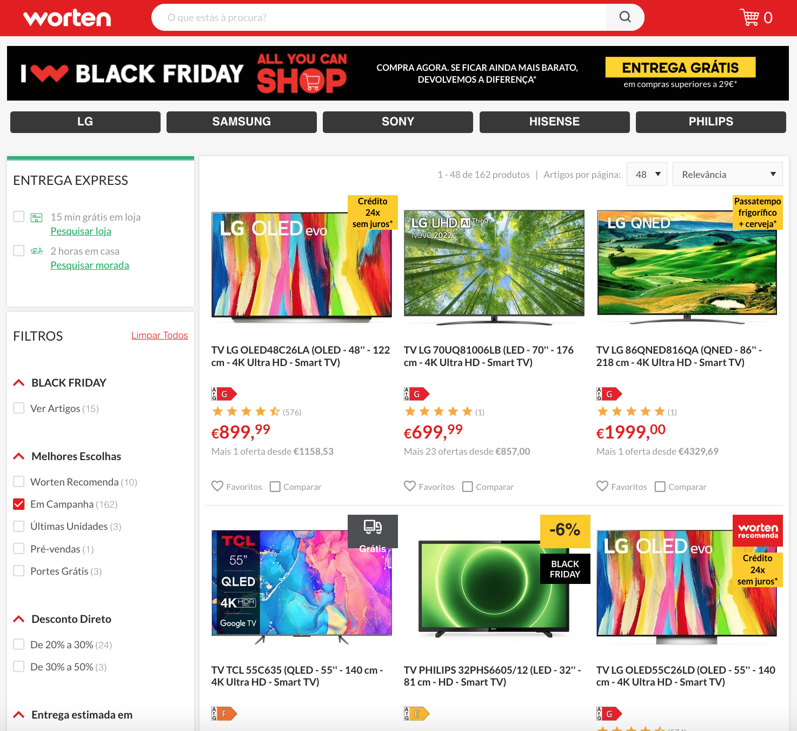
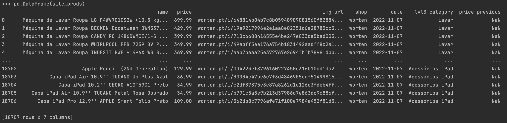
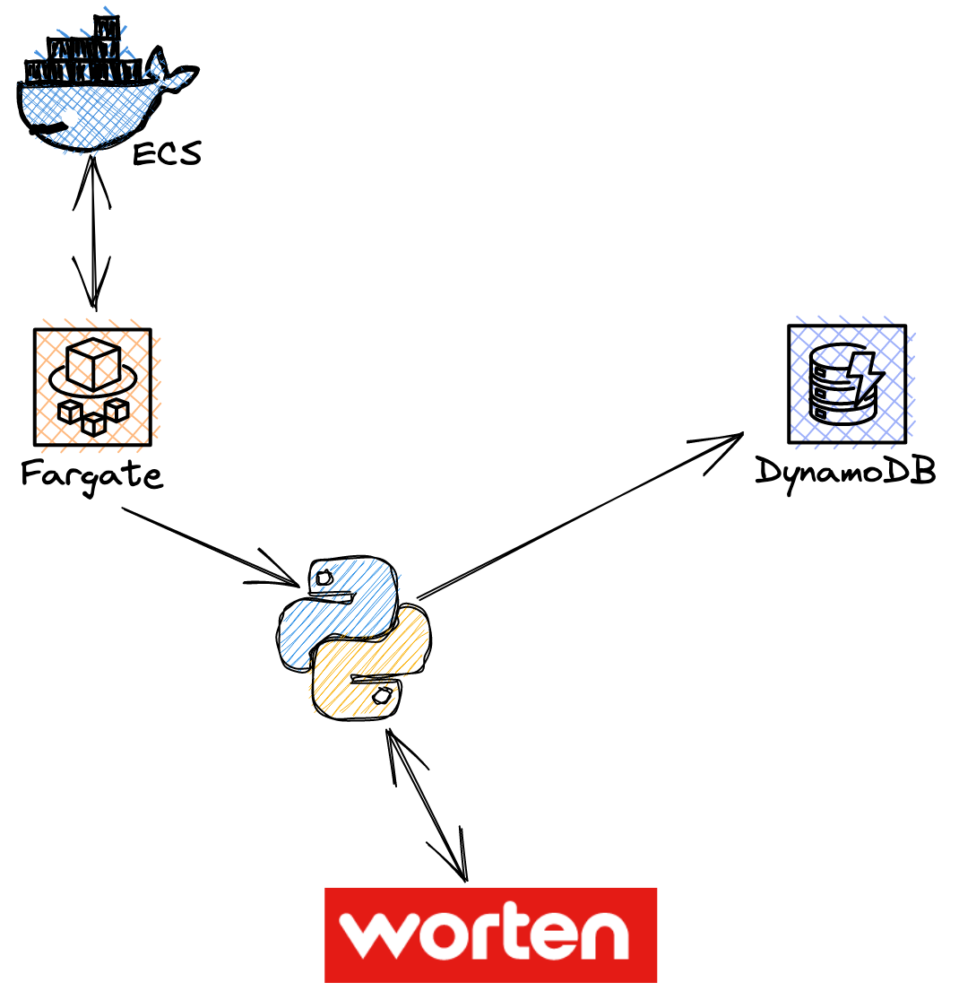

# Shop Web Scraper
## Description
As a Data Scientist, I know that no algorithm no matter how good can be of any use without data. Unfortunately, 
data is not always readily available in a Data Base or a convenient API call away. This desire to get more data 
sources is what initiated this scraping project. I was then further motivated by the need to understand price 
evolution to guide my consumer decisions in an ever-changing economic scenario plagued by inflation.

Being currently based in Portugal and having a fondness for electronic products (if you’re reading this then as a 
techie you probably have one too) I decided to create a web-scraper for the biggest electronics shop in Portugal, 
“Worten”. 

The products on this site are organised in a hierarchical category system, currently, this system is configured 
to only extract these 4 main categories:
* Big household appliances ('Grandes Eletrodomésticos')
* Small household appliances ('Pequenos Eletrodomésticos')
* Mobile phones and TV packages ('Telemóveis e Pacotes de TV')
* IT and accessories ('Informática e Acessórios')

The scraper extracts the name of the subcategory each product belongs to, its name, price, previously listed price 
and image URL 
as well as the scrape date to construct a historical view of the product. This information is then stored in S3

## Roadmap
Currently, this project is in the 2nd phase of its 3-phase development:
1)	**Local mode**: repo can be painfully installed on your local machine. It requires the user to install the right 
version of the chrome driver to match his existing chrome browser installation. 
2)	**Docker mode**: install seamlessly via docker, allowing the user to scrape with single docker run command
3)	**AWS mode**: run in AWS using a fully serverless solution by deploying the Docker image to ECS, have it run on 
Fargate weekly and store the data on DynamoDB.

